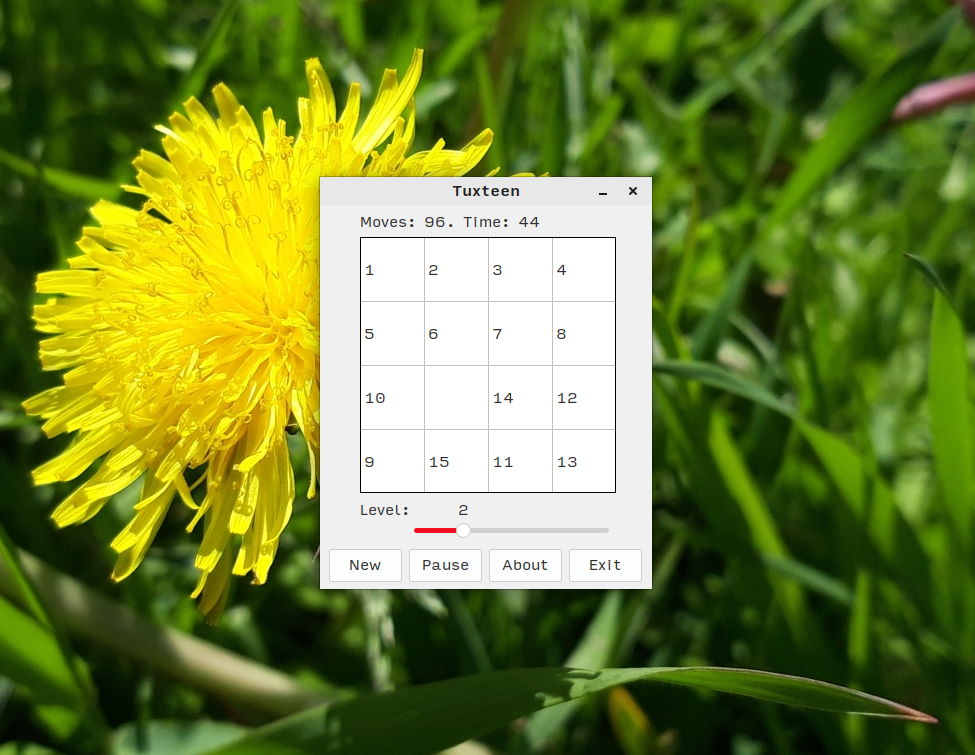

# Tuxteen

### Упоротая игра "Пятнашки" для Linux

**[[English](README.md) / [Русский](README-RU.md)]**

---

**Tuxteen** - моя собственная (!!!!!) реализация старой доброй игры ["Пятнашки"](https://ru.wikipedia.org/wiki/%D0%98%D0%B3%D1%80%D0%B0_%D0%B2_15). Особо рассказывать про этот проект мне нечего. Игра была написана мной за пару вечеров сидения за компом в сентябре 2022 года. Название происходит от ["Tux"](https://ru.wikipedia.org/wiki/Tux), маскота операционной системы Linux - и это неспроста: игра была разработана исключительно для Linux, написана с использованием Lazarus IDE, Free Pascal \[Compiler\] и библиотеки графического интерфейса GTK. Не менее упоротый логотип для проекта я слепил в GIMP, неплохо поиздевавшись над пингвином (да простит меня Ларри Юинг за это).

Этот шедевр был выпущен мной в свет на условиях лицензии GNU GPL, да ещё и под моим старым никнеймом ("NobootRecord"). В настоящий момент времени исходные коды проекта доступны на условиях [Нелицензии](UNLICENSE.txt), поскольку я больше не работаю над этим проектом, и его коды мне нафиг больше не нужны.

**P. S.:** Бинарные сборки для ~~маздая~~ Windows от меня не ждите - мне лень поднимать виртуальную машину и катать туда лазарус ради этого поноса узбека :)

