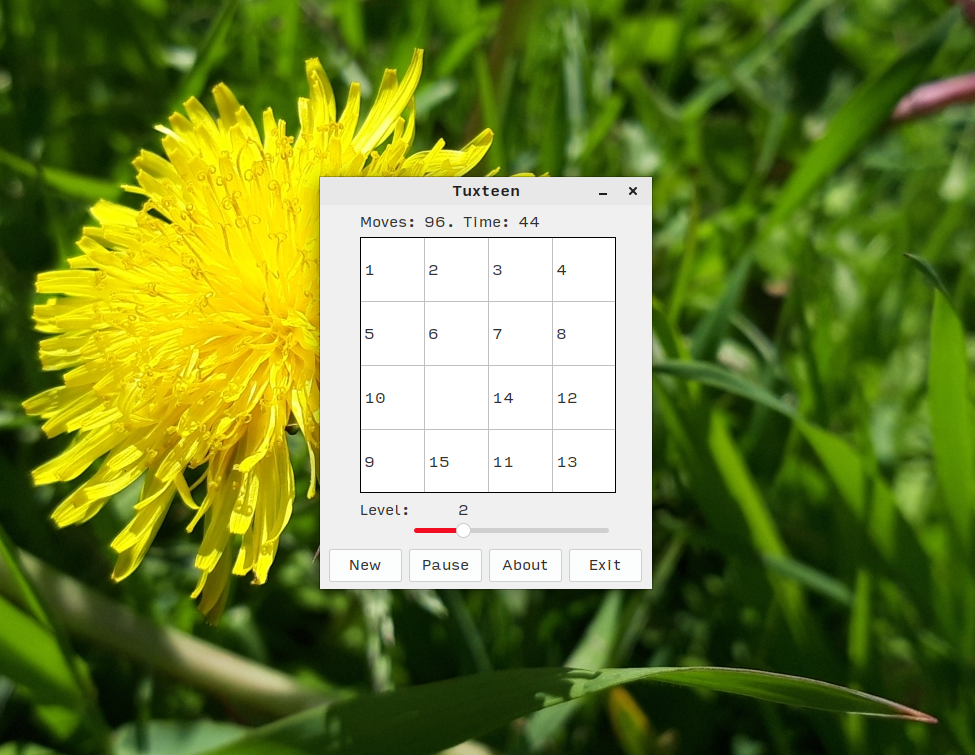

# Tuxteen

### My shitty "15 Puzzle" game for Linux lol

**[[English](README.md) / [Русский](README-RU.md)]**

---

Well, nothing special. **Tuxteen** is just another desktop realization of the [15 Puzzle](https://en.wikipedia.org/wiki/15_Puzzle) game. The funniest thing is that this game has been developed for Linux only - that's why it's called "Tuxteen" ([Tux](https://en.wikipedia.org/wiki/Tux_(mascot)) - a symbol of Linux lol). I have written this game in September 2022 with Lazarus IDE (GTK2) and Free Pascal \[Compiler\]. Project logo has been poorly drawn by me using GIMP.

Tuxteen had been licensed under the terms of GNU GPL and released under my old nickname ("NobootRecord"). Now (December 2023) I release its source codes (modified and fixed a bit) under the terms of [The Unlicense](UNLICENSE.txt), as I am no longer working on this project.

**P. S.:** I am not planning to release Tuxteen binaries for ~~MuzzDie~~ Windows just because I am too lazy to do something more with this piece of shitcode :)

